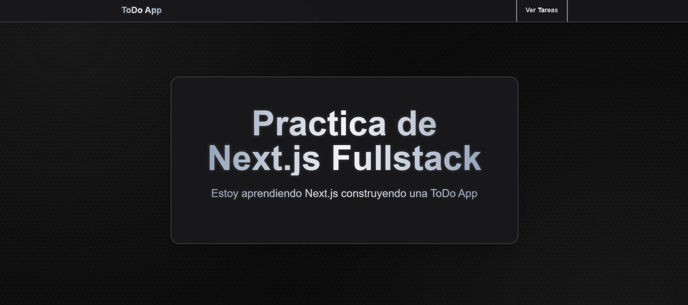
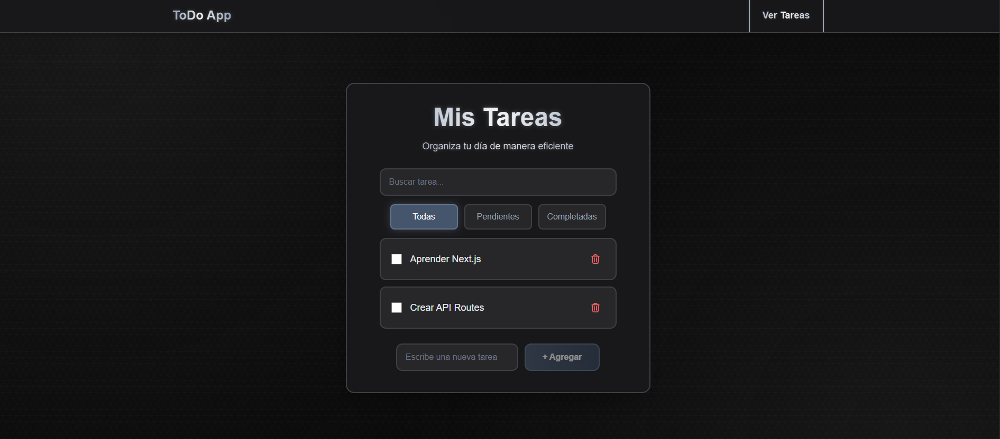

#  ToDo App - Práctica Next.js Fullstack

Una aplicación de gestión de tareas moderna construida con Next.js 14.


## Capturas de pantalla



## Descripción del Proyecto

Este proyecto es una aplicación fullstack de gestión de tareas (ToDo App) que permite crear, leer, actualizar y eliminar tareas. Fue desarrollado como práctica para aprender sobre Next.js 14, incluyendo Server Components, Client Components y API Routes.

## Características

- **CRUD Completo**: Crear, leer, actualizar y eliminar tareas
- **Búsqueda en tiempo real**: Filtra tareas por título
- **Filtros por estado**: Todas, Pendientes, Completadas

## Tecnologías Utilizadas

### Frontend
- **Next.js 14** 
- **React 18** 
- **TypeScript** 
- **Tailwind CSS** 

### Backend
- **Next.js API Routes** - Endpoints RESTful
- **Server Components** - Renderizado del lado del servidor
- **In-Memory Storage** - Almacenamiento temporal de datos

## ¿Por qué API Routes y no Server Actions?

Elegí API Routes (en `app/api/.../route.ts`) para practicar un enfoque REST (GET/POST/PUT/DELETE) y entender mejor el flujo completo de Request/Response que maneja Next.js  

## ¿Qué aprendí?

### 1. **Arquitectura de Next.js 14**
- Aprendí la diferencia entre Server Components y Client Components, cómo se usan y qué casos de uso tienen

### 2. **API Routes**
- Manejé la creación de endpoints RESTful (GET, POST, PUT, DELETE) con Next.js
- Aprendí cómo utilizar esos endpoints en los componentes de Next.js

### 3. **Gestión de Estado en React**
- Entendí cómo se usa `useState` para estado local y cambios para re-renderizado
- Entendí por qué se usa `useEffect` y sus diferencias con useState
- Cuándo no usar `useEffect` y `useState`, y cómo usarlos

### 4. **Comunicación entre Componentes**
- Entendí qué son los Props y callbacks
- Aprendí cómo se componen los componentes de Next.js y cómo llevar un código modular dentro del framework

## Instalación y Uso
1. **Clonar el repositorio**
```bash
git clone https://github.com/AngelDev-08/practica-nextjs-fullstack.git
cd practica-nextjs-fullstack
```

2. **Instalar dependencias**
```bash
npm install
```

3. **Ejecutar en desarrollo**
```bash
npm run dev
```

4. **Abrir en el navegador**
```
http://localhost:3000
```

## Estructura del Proyecto

```
practica-nextjs/
├── app/
│   ├── api/
│   │   └── tasks/
│   │       └── route.ts          # API Routes (CRUD)
│   ├── components/
│   │   ├── Navbar.tsx            # Barra de navegación
│   │   └── TaskActions/
│   │       ├── TaskFilter.tsx    # Filtros y búsqueda
│   │       ├── TaskForm.tsx      # Formulario de creación
│   │       ├── TaskItem.tsx      # Item individual
│   │       └── TaskList.tsx      # Lista y lógica de filtrado
│   ├── tasks/
│   │   └── page.tsx              # Página de tareas
│   ├── layout.tsx                # Layout principal
│   ├── page.tsx                  # Página de inicio
│   └── globals.css               # Estilos globales
└── package.json
```

## Mejoras futuras

- Persistencia en base de datos (MongoDB / PostgreSQL)
- Autenticación y usuarios (por ejemplo, OAuth)
- Validación más robusta y manejo de errores
- Tests (unitarios y de integración)
- Paginación / ordenamiento (si crece el número de tareas)
- Migrar algunas acciones a **Server Actions** como práctica adicional

## Conclusiones

Este proyecto me permitió explorar Next.js 14, entender la separación entre Server y Client Components y practicar la creación de una API RESTful dentro del mismo framework.

Más allá de construir una ToDo App funcional con CRUD completo, filtros y búsqueda, utilicé esta práctica para demostrar mi flexibilidad, proactividad y adaptabilidad a nuevas herramientas y entornos.  

El resultado es una aplicación fullstack funcional, que refleja mi dedicación y pasión por aprender y mejorar.

¡Gracias por tomarte el tiempo de revisar el proyecto!

## Autor
**Angel Astorga** – Práctica de Next.js Fullstack
